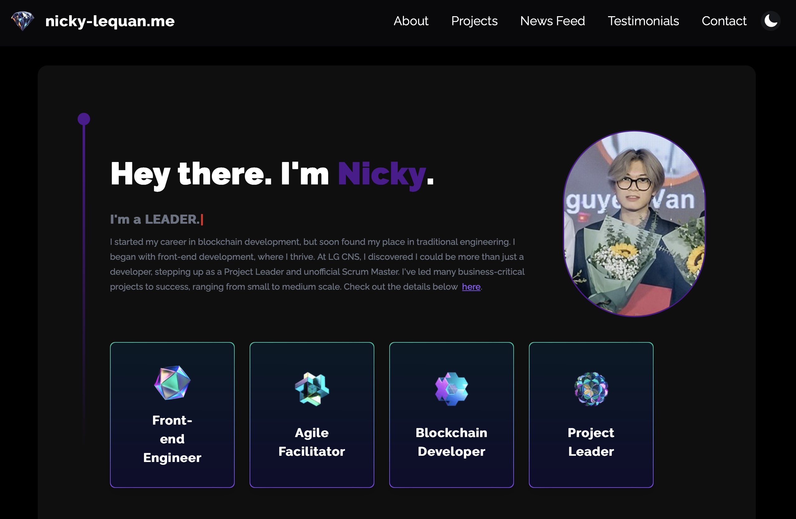
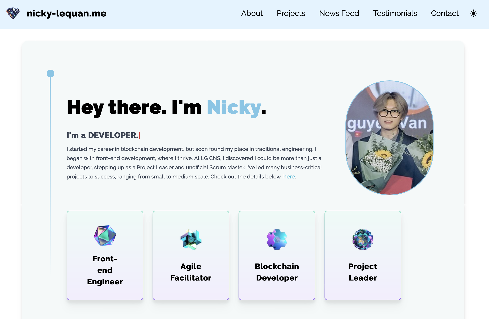

# about-jooncco
A developer portfolio page made with Next.js 14, tailwindcss and three.js.  
You can see the demo [here](https://jooncco.me).

<figure style="display: flex; gap: 20px;">
    
    
</figure>

## Features

- 2 pages, 8 sections that can showcase your strength to get you hired.
    - `/`
        - About
        - Projects
        - Skills
        - Portfolio
        - Competitive Programming
        - Achievements
        - Testimonials
    - `/contact`
        - Contact
- Leetcode & Codeforces integration for live contest data fetch
- Send email using email.js
- Download resume
- Dark mode

## Getting Started

### Install Node.js

https://nodejs.org/


### Clone
```
git clone https://github.com/jooncco/about-jooncco.git
```

### Install dependencies

```bash
npm install
```

### Customize

#### 1. Replace static files with yours.

- `/public/Resume-Junha-en.pdf`
- `/public/Resume-Junha-ko.pdf`
- `/public/assets/images/logo.png`
- `/public/assets/images/about/profile.png`
- `/public/assets/images/achievements/*{your_glorious_moments.png}`
- `/public/assets/images/company/*{logo_of_your_company.png}`
- `/public/assets/images/portfolio/*{thumbnail_of_your_project.jpg}`

#### 2. Replace contents of each section with your story.

Contents are maintained inside `constants.js`, in each component&apos;s derectory.

#### 3. Configure competitive programming handle

`/services/external/Leetcode/config.js`  
```javascript
export const API_ENDPOINT = "https://leetcode.com/graphql";
export const USERNAME = "<YOUR_CODEFORCES_HANDLE>";
```

`/services/external/Codeforces/config.js`  
```javascript
export const API_ENDPOINT = "https://leetcode.com/graphql";
export const USERNAME = "<YOUR_LEETCODE_ID>";
```

#### 4. Configure emailjs.

First, sign up and create email template at [emailjs](https://www.emailjs.com/).  
Fill up necessary info to send emails.  

`/services/external/Emailjs/config.js`  
```javascript
export const EMAILJS_SERVICE_ID = '<YOUR_EMAILJS_SERVICE_ID>';
export const EMAILJS_TEMPLATE_ID = '<YOUR_EMAILJS_TEMPLATE_ID>';
export const EMAILJS_PUBLIC_KEY = '<YOUR_EMAILJS_PUBLIC_KEY>';
```

### Run

```bash
npm run dev
```

## License

MIT License

Copyright (c) 2023 JunHa Jeong

Permission is hereby granted, free of charge, to any person obtaining a copy
of this software and associated documentation files (the "Software"), to deal
in the Software without restriction, including without limitation the rights
to use, copy, modify, merge, publish, distribute, sublicense, and/or sell
copies of the Software, and to permit persons to whom the Software is
furnished to do so, subject to the following conditions:

The above copyright notice and this permission notice shall be included in all
copies or substantial portions of the Software.

THE SOFTWARE IS PROVIDED "AS IS", WITHOUT WARRANTY OF ANY KIND, EXPRESS OR
IMPLIED, INCLUDING BUT NOT LIMITED TO THE WARRANTIES OF MERCHANTABILITY,
FITNESS FOR A PARTICULAR PURPOSE AND NONINFRINGEMENT. IN NO EVENT SHALL THE
AUTHORS OR COPYRIGHT HOLDERS BE LIABLE FOR ANY CLAIM, DAMAGES OR OTHER
LIABILITY, WHETHER IN AN ACTION OF CONTRACT, TORT OR OTHERWISE, ARISING FROM,
OUT OF OR IN CONNECTION WITH THE SOFTWARE OR THE USE OR OTHER DEALINGS IN THE
SOFTWARE.
